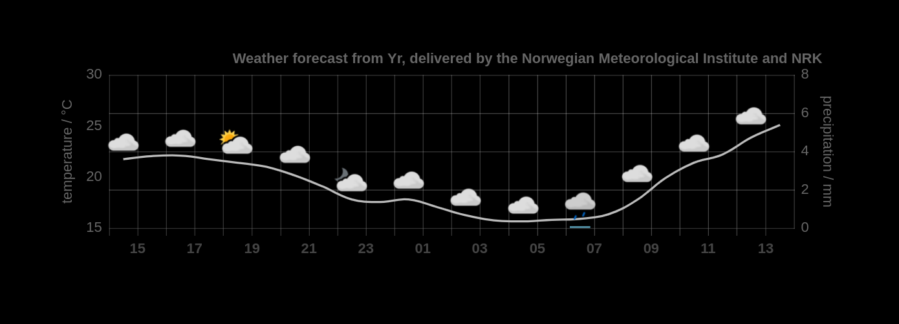

# Simple Weather Graph
Hourly weather prediction graph using [ChartJS](https://www.chartjs.org) and the weather forecast from [Yr](https://developer.yr.no), delivered by the Norwegian Meteorological Institute and NRK.
The applet is loosely inspired by the [Aix Weather Widget](https://github.com/pveierland/aix-weather-widget) for Android.



The location for weather prediction can be provided in the url query string using geographical coordinates directly, i.e. specifying `lat` and `long` in decimal degrees (e.g. `http://localhost/index.php?lat=52.52437&long=13.41053`)
An elevation value in meters can optionally be provided to the `el` parameter.
Alternatively, a city name can be provided for the `loc` parameter, which is resolved using a local copy of the [GeoNames](https://www.geonames.org) "cities500" database.
It has to be url encoded, e.g. spaces are written as `%20` (e.g. `http://localhost/index.php?loc=New%20York%20City`)

A purely static version with hard coded location is provided with `index.html`.
However, per API [data access regulations](https://hjelp.yr.no/hc/en-us/articles/360001946134-Data-access-and-terms-of-service) data has to be cached for 60 minutes, so `index.php` should be used for any deployment.
In that case the user agent specified there should be changed (see [terms of service](https://api.met.no/doc/TermsOfService)).

# Resources
- [Forecast API](https://api.met.no/weatherapi/locationforecast/2.0/documentation) by the Norwegian Meteorological Institute
- The weather icons are owned by the Norwegian Meteorological Institute and are provided via their [Weathericon API](https://api.met.no/weatherapi/weathericon/2.0/documentation).
They can be downloaded and scaled down using:
```sh
$ curl -X GET --header 'Accept: application/x-download' 'https://api.met.no/weatherapi/weathericon/2.0/data' --output icons.tar.gz
$ tar -xf icons.tar.gz
$ cd png
$ for i in *.png; do convert $i -resize 25% $i; done;
```
- The [GeoNames](https://www.geonames.org) "cities500" database needs to be downloaded locally and converted to SQLite.
This is automated with `geonames-txt2sqlite.py`.

# Todos
- Update to ChartJS v3
- Shift temperatures instead of averaging them and plot lines up to edges
- Resize canvas and icons dynamically in JS based on screen resolution (this creates a lot of unnecessary computation for now)
